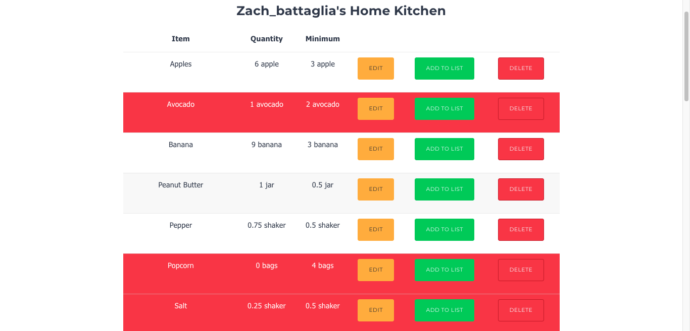
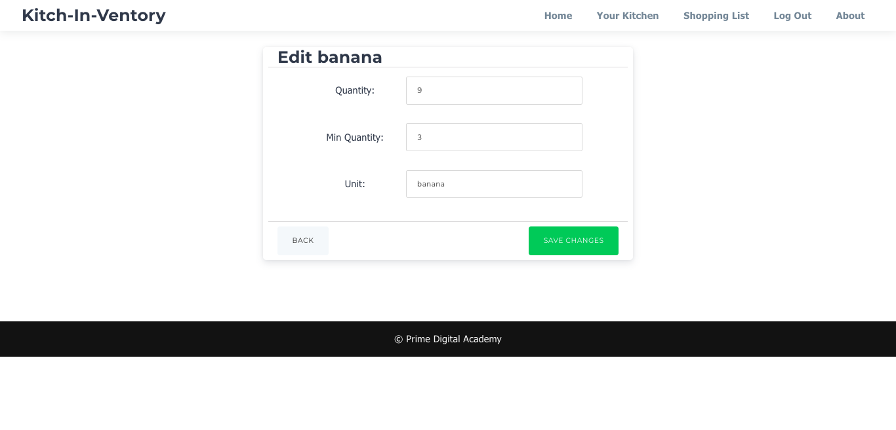
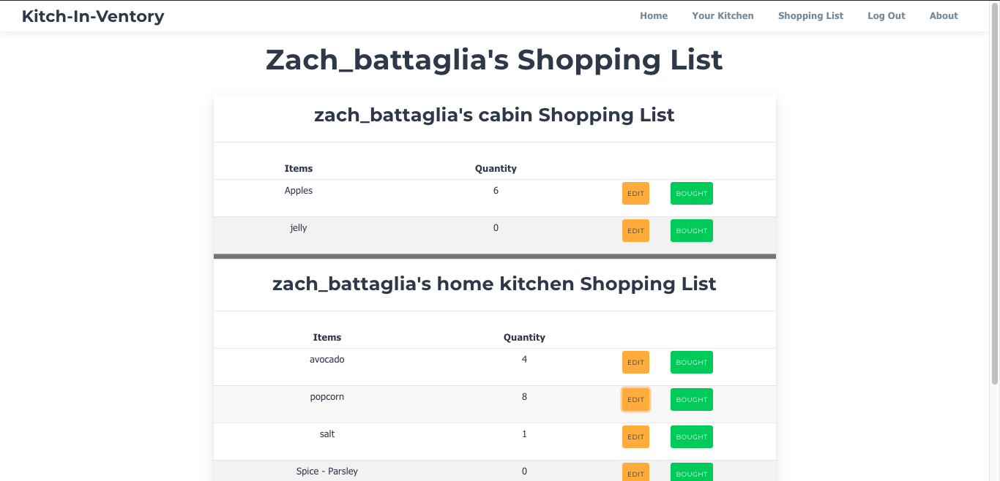

# Kitch-In-Ventory

## Description

_Duration: 2 Week Sprint_

This application allows user's to create a kitchen and keep track of everything in that kitchen. The application automatically generates a shopping list for user's of items that are running low in their kitchen and user's can also manually add items to their list for their next trip to the store. User's can invite other user's of the app to join their kitchen so shopping list's can be shared between multiple people.

The purpose of this project was to develop a fully functional React application that requires user authentication and storing of data in a database. Another goal of this project was to design an application that was responsive to mobile screen sizes to allow user's to interact with their shopping list while in the store grocery shopping.

To see the fully functional site, please visit: [DEPLOYED VERSION OF APP](www.heroku.com)

## Screen Shot

### Prerequisites

Link to software that is required to install the app (e.g. node).

- [Node.js](https://nodejs.org/en/)
- List other prerequisites here

## Installation

1. Create a database named `kitchen_inventory_app`,
2. The queries in the `queries.sql` file are set up to create all the necessary tables and populate the needed data to allow the application to run correctly. The project is built on [Postgres](https://www.postgresql.org/download/), so you will need to make sure to have that installed. We recommend using Postico to run those queries as that was used to create the queries 
3. Create a .env file at the root of the project and paste this line into the file:
    SERVER_SESSION_SECRET=superDuperSecret
While you're in your new .env file, take the time to replace superDuperSecret with some long random string like 25POUbVtx6RKVNWszd9ERB9Bb6 to keep your application secure. Here's a site that can help you: https://passwordsgenerator.net/.
4. (OPTIONAL) To enable the email functionality of this application include the following lines in your .env file.
    Password, username, and email need to be for a valid gmail account (Note this will remain private in the .env file)
    PASSWORD=*******
    USERNAME=*******
    EMAIL=********
5. Open up your editor of choice and run an `npm install`
6. Run `npm run server` in your terminal
7. Run `npm run client` in your terminal
8. The `npm run client` command will open up a new browser tab for you!

## Usage

Note: At any time you may click the about tab at the top of the page for some general instructions.

1. To register an account click the register link and select a username and password and provide an email. (Note email is only required for sending/receiving email invitations. If you do not wish to provide an email you can enter anything in this field)
2. Once logged-in you are taken to the user home page that will list all your current kitchens and invitations.
3. Clicking on a kitchen will take you to that kitchen's inventory page listing all the items, quantities, and minimum quantites.
4. Items can be added to the current kitchen via the add item form at the bottom of the kitchen page.
5. You can edit or delete items in a kitchen with the respective buttons next to the item. Items that are running low will be highlighted in red and automatically added to the shopping list.
6. Selecting the ADD button next to an item will add it to the list even if it is above its minimum quantity.
7. The Shopping List tab at the top will take you to the user's shopping list. This will list all items for that user that are running low or have been manually added to the list in all of their kitchens. These are separated by kitchen and ordered alphabetically.
8. The edit button allows a user to select a quantity of an item on the shopping list to "add to their cart". Clicking "bought" then removes this item from the shopping list and adds that quantity to the kitchen's inventory.
9. An item can be deleted from a shopping list without changing the quantity in the inventory with the "remove" button. (Note: This is only available for items that are not below their minimum quantity.)
10. Other user's can be invited to join a kitchen from the home page with their username and will have full access to the kitchen inventory and shopping list.

## Built With

- JavaScript
- React
- Node.js
- Redux-Saga
- Express
- Postgres
- SQL
- HTML
- CSS
- Cirrus CSS
- Nodemailer

## Acknowledgement
Thanks to [Prime Digital Academy](www.primeacademy.io) who equipped and helped me to make this application a reality.
Thanks to my instructors for teaching me all of these technologies in such a short amount of time, and my classmates for learning everything wit me.

## Support
If you have suggestions or issues, please email me at [zbattaglia3@gmail.com](www.google.com)
